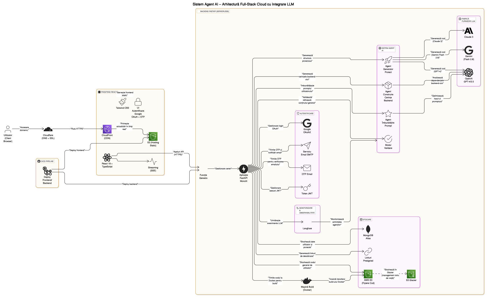
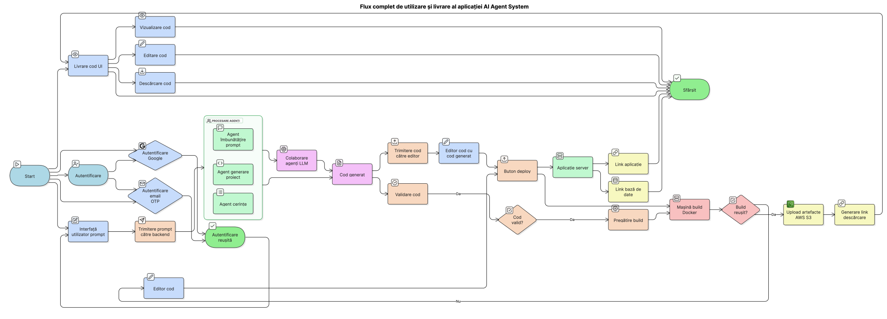

# Bachelor Project - AI Agent System 

A web application built with FastAPI and React, implementing an advanced AI agent system with project management and generating code capabilities. The system features multiple specialized agents working together to provide intelligent assistance and project management.

## 🏗️ Detailed Architecture



This detailed architecture diagram shows the complete stack of our application, including:
- Client Layer (React, Redux, Tailwind)
- API Gateway Layer (FastAPI, Auth, SSE)
- AI Layer (Agent Factory, LLM Providers, Monitoring)
- Cloud Infrastructure (AWS, MongoDB, Genezio)

## 📊 System Architecture (Flow)



The diagram above illustrates the system's architecture and data flow, showing how different components interact to provide a seamless experience.


## 🚀 Features

### Backend (FastAPI)
- **Advanced AI Agent System**
  - Specialized agents for different tasks:
    - Project Generator Agent: Creates and manages project structures
    - Backend Requirements Builder: Analyzes and generates backend dependencies
    - Enchant User Prompt: Enhances and optimizes user inputs
  - Agent Factory pattern for dynamic agent creation
  - Streaming responses for real-time agent interactions
  - Langfuse integration for:
    - Event tracking and monitoring
    - Cost analysis
    - Performance metrics
    - Session management
    - Prompt engineering insights and management

- **Authentication System**
  - Google OAuth2 authentication
  - JWT token-based session management
  - User profile management
  - Role-based access control
  - Email-based OTP verification
  - Secure password reset flow

- **Code Generation & Deployment**
  - Automated code generation
  - Build machine integration for:
    - Docker containerization
    - Automated deployment
    - Environment configuration
    - Service orchestration
  - Project structure generation
  - Dependency management
  - AWS S3 integration for:
    - Static file hosting
    - Glacier Instant Retrieval storage class for cost optimization
    - Lifecycle policies for automatic tiering
    - Server-side encryption (AES-256) for data security

### Frontend (React + TypeScript)
- Modern, responsive UI built with React 18
- TypeScript for type safety and better development experience
- Tailwind CSS for styling
- Dark/Light theme support with system preference detection
- Real-time updates using Server-Sent Events
- Interactive project management interface
- Agent interaction interface
- Real-time agent status monitoring
- Project analytics dashboard
- Google OAuth integration

## 🏗️ Technical Architecture

### System Components
1. **Frontend Layer**
   - React-based user interface
   - Real-time updates via SSE
   - Secure authentication flow
   - Project management dashboard

2. **Backend Layer**
   - FastAPI server
   - Agent orchestration
   - Database management
   - File storage handling

3. **AI Layer**
   - Multiple specialized agents
   - LLM integration
   - Prompt management
   - Response streaming

4. **Infrastructure Layer**
   - AWS services integration
   - Database provisioning
   - Container orchestration
   - CDN distribution

### Backend Technologies
- **Framework**: FastAPI (Python 3.13)
- **Database**: MongoDB with Beanie ODM
- **AI/ML**: 
  - Custom agent implementations
  - OpenAI GPT models for natural language processing
- **API Generation**:
  - REST API endpoints generation
  - GraphQL schema and resolvers generation
  - OpenAPI/Swagger documentation
- **Authentication**: 
  - Google OAuth2
  - JWT with refresh tokens
  - Email OTP verification
- **Cloud Services**:
  - AWS S3 for file storage
  - Genezio Functions for serverless deployment
  - AWS CloudFront for CDN
- **Email Service**:
  - SMTP integration
  - HTML email templates
  - OTP delivery
- **Monitoring**: Langfuse for LLM observability
- **Real-time Communication**: Server-Sent Events (SSE) for streaming responses
- **Testing**: Pytest with async support
- **Documentation**: OpenAPI/Swagger
- **Containerization**: Docker
- **CI/CD**: GitHub Actions

### Frontend Technologies
- **Framework**: React 18 with TypeScript
- **State Management**: Redux Toolkit
- **Styling**: 
  - Tailwind CSS
  - CSS Modules
  - Dark/Light theme system
- **Real-time**: EventSource for streaming responses
- **Authentication**: @react-oauth/google
- **Testing**: Vitest + React Testing Library
- **Build Tool**: Vite
- **Code Quality**: ESLint + Prettier
- **Package Manager**: npm/yarn
- **UI Components**:
  - Headless UI
  - Custom components
  - Responsive design
  - Accessibility support

### Database Schema (MongoDB with Beanie ODM)
```
├── User
│   ├── username: str
│   ├── email: str
│   ├── auth_provider: str
│   ├── hashed_password: Optional[str]
│   ├── otp_code: Optional[str]
│   ├── otp_expiration: Optional[datetime]
│   ├── verified: bool
│   ├── created_at: datetime
│   ├── updated_at: datetime
│   ├── profile_picture: Optional[str]
│   ├── token_usage: int
│   └── subscription: dict
│       ├── name: str
│       ├── description: str
│       ├── price: float
│       └── max_tokens: int
│
├── Project
│   ├── idea: str
│   ├── user_id: str
│   ├── is_public: bool
│   ├── s3_folder_name: Optional[str]
│   ├── s3_presigned_url: Optional[str]
│   ├── db_uri: Optional[str]
│   ├── region: Optional[str]
│   ├── name: Optional[str]
│   ├── deployment_url: Optional[str]
│   ├── database_uri: Optional[str]
│   ├── created_at: datetime
│   ├── updated_at: datetime
│   └── deleted_at: Optional[datetime]
│
└── ActiveSession
    ├── user_id: PydanticObjectId
    ├── session_token: str
    ├── expire_at: datetime
    └── created_at: datetime
```

### Agent Architecture
```
├── Agent Factory
│   ├── Project Generator Agent
│   │   ├── Project Structure Creation
│   │   ├── Code Generation
│   │   ├── REST API Generation
│   │   │   ├── Endpoint Creation
│   │   │   ├── Request/Response Models
│   │   │   └── OpenAPI Documentation
│   │   └── GraphQL Generation
│   │       ├── Schema Definition
│   │       ├── Resolver Implementation
│   │       └── Type Generation
│   ├── Backend Requirements Builder
│   │   ├── Dependency Analysis
│   │   └── Requirements Generation
│   └── Enchant User Prompt
│       ├── Input Enhancement
│       └── Context Optimization
│
├── LLM Provider Factory
│   ├── OpenAI Provider
│   │   ├── GPT-4
│   │   └── GPT-3.5
│   ├── Anthropic Provider
│   │   └── Claude 3
│   ├── Local Provider (Next Step)
│   │   └── Local Model Integration
│   └── Google Gemini Provider (Planned)
│       └── Gemini Flash 2.0   
│
└── Database Provisioning
    ├── MongoDB
    │   ├── Connection String Generation
    │   └── Database Setup
    └── PostgreSQL
        ├── Connection String Generation
        └── Database Setup
```

